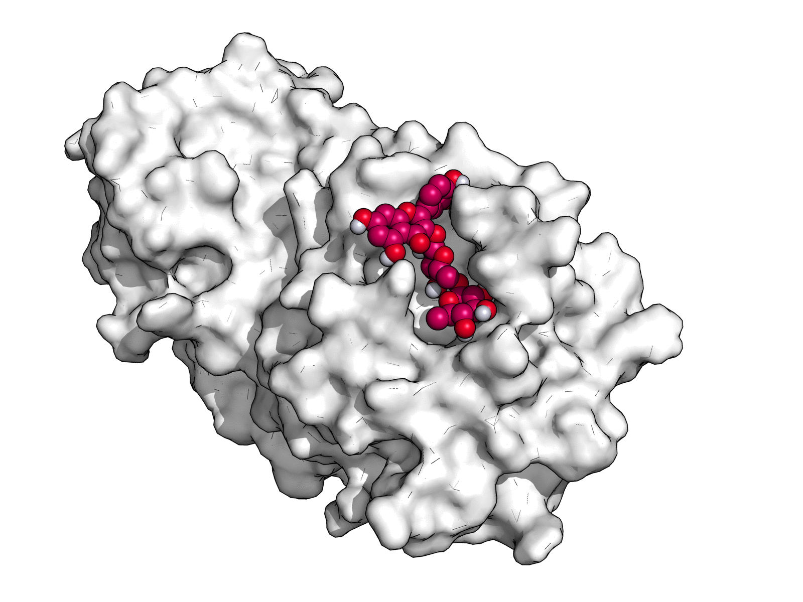
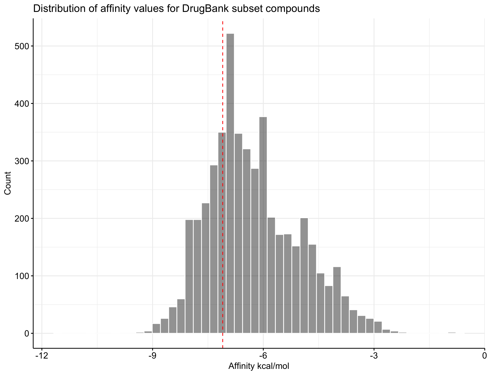
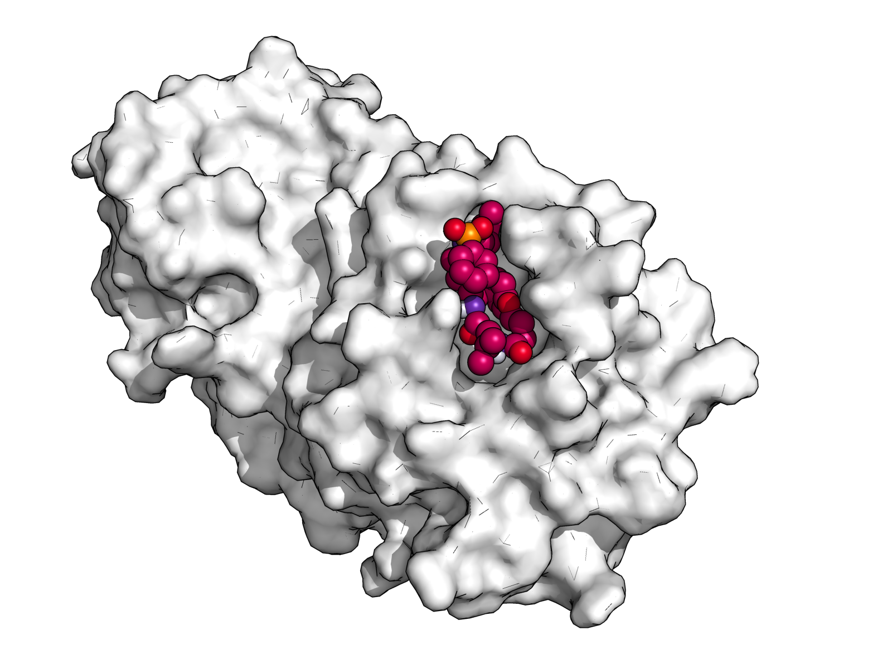
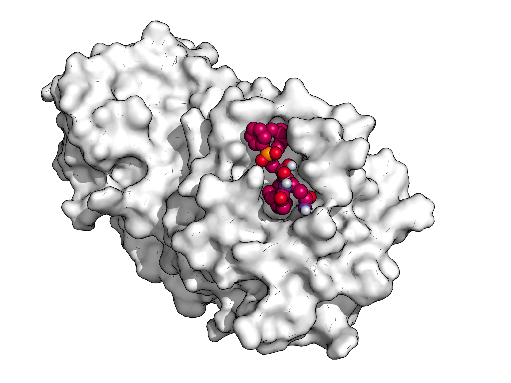
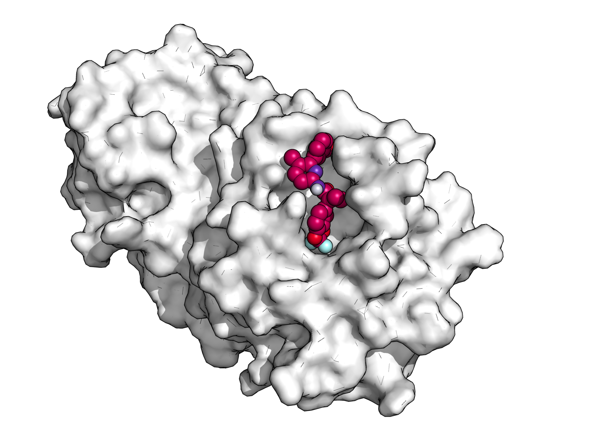

# Docking of compounds against the SARS-CoV-2 protease structure


## Getting started

### Requirements 


- [AutoDock Vina](http://vina.scripps.edu/). This is for carrying out the docking itself. It can be obtained [from Anaconda](https://anaconda.org/bioconda/autodock-vina).
- [AutoDockTools](http://autodock.scripps.edu/resources/adt) is optionally required for selecting docking grid box.
- [Open Babel](http://openbabel.org/wiki/Main_Page). This is for converting pdb/smiles formats to pdbqt required for docking. It can be obtained [from Anaconda](https://anaconda.org/openbabel/openbabel).
- [PyMol](https://pymol.org/2/) for visualizing drug-ligand interactions.

**If you are like myself and have never done any docking, I would reccomend walking through the [AutoDock Vina tutorial by Oleg Trott](http://vina.scripps.edu/tutorial.html).**


### Preparing the protein for docking

- The protein used for the docking is pdb ID 6LU7 [COVID19 main protease in complex with an inhibitor](https://www.rcsb.org/pdb/explore/sequenceCluster.do?structureId=6LU7). Using AutoDockTools, any solvent molecules and existing ligands are first removed and polar hydrogens are added. The saved protein pdbqt file is provided in [`protein/x.pdb`](protein/x.pdb).

- The grid box must then be defined in AutoDockTools. This tells the docking software where what regions of the protein to attempt docking to. The grid box I have defined is based on the protease active site and has the following parameters: 

```
center_x = 11.748
center_y = 0.681
center_z = 4.364

size_x = 40
size_y = 76
size_z = 70
```

See the [AutoDock Vina tutorial](http://vina.scripps.edu/tutorial.html) for how to do this. 

## Docking Quercetin analogues

The first batch of compounds that were docked are analogues of Quercetin. Quercetin is plant pigment (flavonoid) that is found in many plants and foods, such as red wine and onions. It has shown to have antiviral properties, specifically by inhibiting viral proteases e.g. [PMID:30064445](https://pubmed.ncbi.nlm.nih.gov/30064445/) including that of Ebola [PMID:27297486](https://pubmed.ncbi.nlm.nih.gov/27297486/). There is also a [clinical trial planned](https://www.mcgilltribune.com/sci-tech/montreal-researchers-propose-a-treatment-for-covid-19-170320/) to assess efficiacy of quercetin at inhibiting COVID19.

There are hundreds of compounds that are analogues of quercetin. Using PubChem, I obtained the smiles for any compounds matching "quercetin" in the search result. This resulted in 693 compounds, which can be found in [`quercetin/PubChem_compound_text_quercetin.csv`](quercetin/PubChem_compound_text_quercetin.csv). Smiles for each compound was converted to pdbqt using open babel. Each compound was docked against the COVID19 main protease using an exhaustiveness of 10. A total of 667 compounds were successfully docked. The docked pdbqt files can be found in [`quercetin/docked`](`quercetin/docked`).

Vina uses affinity (in kcal/mol) to assess how well the compound is expected to bind. This table shows the top compounds identified, sorted by affinity. The full list of pdbqt files for these compounds can be found in [`quercetin/quercetin_docking_affinity_results.csv`](quercetin/quercetin_docking_affinity_results.csv).


### Distribution of quercetin analogue affinity to the COVID19 protease

Quercetin is shown in the dotted red line:


### Table of top quercetin analogues ordered by affinity to the COVID19 protease

- Table shows top 20 identified compounds ordered by affinity

|Compound                                                                         |PubChem ID                                                       | Affinity|
|:--------------------------------------------------------------------------------|:----------------------------------------------------------------|--------:|
|2-(3,4-Dihydroxyphenyl)-5,7-dihydroxy-3-[(2S,3R,4S,5S,6R)-3,4,5-trihydroxy-6-... |[10232597](https://pubchem.ncbi.nlm.nih.gov/compound/10232597)   |     -8.6|
|Camellianoside                                                                   |[11988368](https://pubchem.ncbi.nlm.nih.gov/compound/11988368)   |     -8.6|
|Quercetin 3-rhamnosyl-(1->4)-rhamnosyl-(1->6)-glucoside                          |[44259158](https://pubchem.ncbi.nlm.nih.gov/compound/44259158)   |     -8.6|
|Quercetin 3-O-alpha-D-arabinopyranoside                                          |[44259270](https://pubchem.ncbi.nlm.nih.gov/compound/44259270)   |     -8.6|
|CID 129826674                                                                    |[129826674](https://pubchem.ncbi.nlm.nih.gov/compound/129826674) |     -8.6|
|[2-Hydroxy-5-(3,5,7-trihydroxy-4-oxochromen-2-yl)phenyl] 4-aminobenzoate         |[16102833](https://pubchem.ncbi.nlm.nih.gov/compound/16102833)   |     -8.4|
|Quercetin 7-(6''-galloylglucoside)                                               |[44257998](https://pubchem.ncbi.nlm.nih.gov/compound/44257998)   |     -8.4|
|Quercetin 5-glucuronide                                                          |[44259271](https://pubchem.ncbi.nlm.nih.gov/compound/44259271)   |     -8.4|
|Quercetin 3-rhamnosyl-(1->2)-glucosyl-(1->6)-galactoside                         |[44259283](https://pubchem.ncbi.nlm.nih.gov/compound/44259283)   |     -8.4|
|Quercetin 3-methyl ether 7-rhamnoside-3'-xyloside                                |[44259666](https://pubchem.ncbi.nlm.nih.gov/compound/44259666)   |     -8.4|
|[(2R,3S,4S,5R,6S)-3,4,5-Trihydroxy-6-[2-hydroxy-4-(3,5,7-trihydroxy-4-oxochro... |[60150859](https://pubchem.ncbi.nlm.nih.gov/compound/60150859)   |     -8.4|
|2,3-Dehydrosilybin                                                               |[5467200](https://pubchem.ncbi.nlm.nih.gov/compound/5467200)     |     -8.3|
|Quercetin 3-rhamnosyl-(1->6)-glucosyl-(1->6)-galactoside                         |[44259284](https://pubchem.ncbi.nlm.nih.gov/compound/44259284)   |     -8.3|
|CID 129826737                                                                    |[129826737](https://pubchem.ncbi.nlm.nih.gov/compound/129826737) |     -8.3|
|2-(3,4-Dihydroxyphenyl)-5,7-dihydroxy-3-(3,4,5-trihydroxyoxan-2-yl)oxychromen... |[5878729](https://pubchem.ncbi.nlm.nih.gov/compound/5878729)     |     -8.2|
|Alcesefoliside                                                                   |[11828754](https://pubchem.ncbi.nlm.nih.gov/compound/11828754)   |     -8.2|
|Quercetin 3-(3R-glucosylrutinoside)                                              |[44259156](https://pubchem.ncbi.nlm.nih.gov/compound/44259156)   |     -8.2|
|Quercetin 3-(2''',3''',4'''-triacetyl-alpha-L-arabinopyranosyl)(1->6)-glucoside  |[44259196](https://pubchem.ncbi.nlm.nih.gov/compound/44259196)   |     -8.2|
|Quercetin 3-alpha-L-arabionopyranoside-7-glucoside                               |[44259239](https://pubchem.ncbi.nlm.nih.gov/compound/44259239)   |     -8.2|
|3,5,7-Trihydroxy-2-[4-hydroxy-3-[(2R,3R,4S,5S,6R)-3,4,5-trihydroxy-6-(hydroxy... |[67128564](https://pubchem.ncbi.nlm.nih.gov/compound/67128564)   |     -8.2|


### Visualizing top quercetin analogues in complex with the COVID19 protease

#### Camellianoside, PubChem:11988368 (-8.6 kcal/mol)

Has been shown to have an inhibitory effect on the HIV-1 protease [PMID:16926516](https://pubmed.ncbi.nlm.nih.gov/16926516/)


#### Quercetin 3-O-alpha-D-arabinopyranoside, PubChem:44259270 (-8.6 kcal/mol)


#### Quercetin 5-glucuronide, PubChem:44259271 (-8.4 kcal/mol)


#### Alcesefoliside, PubChem:11828754 (-8.2 kcal/mol)


## Docking compounds in DrugBank
To expand this, I smilarly next docked over 5600 compounds found in DrugBank. The smiles for each of those compounds were pulled from [this repository](https://github.com/choderalab/nano-drugbank/blob/master/df_drugbank_smiles.csv), converted to pdbqt files, and used for the vina docking in a similar manner to the quercetin analogues.

This resulted in dozens of compounds with strong binding affinities, many stronger than the strongest quercetin analogue. This table shows the top compounds identified. The full list of docked pdbqt files for these compounds can be found in [`nano_drugbank/docked`](`nano_drugbank/docked`).

The file containing affinities of the docked DrugBank compounds can be found in [`nano_drugbank/drugbank_docking_affinity_results.csv`](nano_drugbank/drugbank_docking_affinity_results.csv).

### Distribution of DrugBank compound affinity to the COVID19 protease

Quercetin is shown in the dotted red line:



### Table of top DrugBank compounds ordered by affinity to the COVID19 protease 

- Table shows top 20 identified compounds ordered by affinity

|Compound                                                                         |DrugBank ID                                      | Affinity|
|:--------------------------------------------------------------------------------|:------------------------------------------------|--------:|
|Radicicol                                                                        |[DB03758](https://www.drugbank.ca/drugs/DB03758) |    -14.4|
|Fluorometholone                                                                  |[DB00324](https://www.drugbank.ca/drugs/DB00324) |    -13.1|
|Exemestane                                                                       |[DB00990](https://www.drugbank.ca/drugs/DB00990) |    -12.8|
|Testolactone                                                                     |[DB00894](https://www.drugbank.ca/drugs/DB00894) |    -12.5|
|4-Androstenedione                                                                |[DB01536](https://www.drugbank.ca/drugs/DB01536) |    -12.2|
|Androstanedione                                                                  |[DB01561](https://www.drugbank.ca/drugs/DB01561) |    -12.2|
|5-BETA-ANDROSTANE-3,17-DIONE                                                     |[DB07375](https://www.drugbank.ca/drugs/DB07375) |    -12.2|
|19-norandrostenedione                                                            |[DB01434](https://www.drugbank.ca/drugs/DB01434) |    -11.7|
|N-[2-Hydroxy-2-(8-Isopropyl-6,9-Dioxo-2-Oxa-7,10-Diaza-Bicyclo[11.2.2]Heptade... |[DB03768](https://www.drugbank.ca/drugs/DB03768) |    -11.5|
|2-(11-{2-[Benzenesulfonyl-(3-Methyl-Butyl)-Amino]-1-Hydroxy-Ethyl}-6,9-Dioxo-... |[DB02411](https://www.drugbank.ca/drugs/DB02411) |    -10.6|
|Conivaptan                                                                       |[DB00872](https://www.drugbank.ca/drugs/DB00872) |     -9.9|
|N-(2-(((5-CHLORO-2-PYRIDINYL)AMINO)SULFONYL)PHENYL)-4-(2-OXO-1(2H)-PYRIDINYL)... |[DB07800](https://www.drugbank.ca/drugs/DB07800) |     -9.3|
|Lumacaftor                                                                       |[DB09280](https://www.drugbank.ca/drugs/DB09280) |     -9.3|
|N-[4-(2-CHLOROPHENYL)-1,3-DIOXO-1,2,3,6-TETRAHYDROPYRROLO[3,4-C]CARBAZOL-9-YL... |[DB07226](https://www.drugbank.ca/drugs/DB07226) |     -9.2|
|SP2456                                                                           |[DB03957](https://www.drugbank.ca/drugs/DB03957) |     -9.1|
|5-(4-PHENOXYPHENYL)-5-(4-PYRIMIDIN-2-YLPIPERAZIN-1-YL)PYRIMIDINE-2,4,6(2H,3H)... |[DB07117](https://www.drugbank.ca/drugs/DB07117) |     -9.1|
|N-[(13-CYCLOHEXYL-6,7-DIHYDROINDOLO[1,2-D][1,4]BENZOXAZEPIN-10-YL)CARBONYL]-2... |[DB08031](https://www.drugbank.ca/drugs/DB08031) |     -9.1|
|4-Oxo-2-Phenylmethanesulfonyl-Octahydro-Pyrrolo[1,2-a]Pyrazine-6-Carboxylic A... |[DB02723](https://www.drugbank.ca/drugs/DB02723) |     -9.0|
|(2e,3s)-3-Hydroxy-5'-[(4-Hydroxypiperidin-1-Yl)Sulfonyl]-3-Methyl-1,3-Dihydro... |[DB03583](https://www.drugbank.ca/drugs/DB03583) |     -9.0|
|(5S)-5-(2-amino-2-oxoethyl)-4-oxo-N-[(3-oxo-3,4-dihydro-2H-1,4-benzoxazin-6-y... |[DB07397](https://www.drugbank.ca/drugs/DB07397) |     -9.0|


*Visualizing top DrugBank compounds in complex with the COVID19 protease*


#### EXPT01695, DB03768 (-11.5 kcal/mol)



#### EXPT01696, DB02411 (-10.6 kcal/mol)



#### Conivaptan, DB00872 (-11.5 kcal/mol)


#### Lumacaftor, DB09280 (-9.3 kcal/mol)



#### Dolutegravir, DB08930 (-8.9 kcal/mol)
- Dolutegravir is an existing FDA-approved HIV-1 antiviral agent. It inhibits HIV integrase by binding to the active site and blocking the strand transfer step of retroviral DNA integration in the host cell.
- Also predicted as an effective treatment for COVID19 in [this paper](https://www.genengnews.com/artificial-intelligence/ai-predicts-coronavirus-vulnerable-to-hivs-atazanavir/).


## TODO

- Fix bug where babel does not correctly convert smiles into the correct pdbqt file, resulting in inflated affinity values
- Update remaining DrugBank molecules when they are finished running
- Re-run top compounds at higher exhaustiveness


